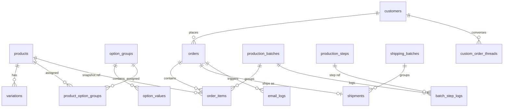

# DB設計書 v1.0 — 葉車堂 一元管理システム
対象:Supabase (PostgreSQL 15) / 作成日:2026-07-12
根拠文書:要件定義書v2.0、BASE構造調査結果

---

## 0. 設計原則

1. **二重ステータス分離**:決済状態は `orders.payment_status`、生産状態は `order_items.production_status`。相互に独立遷移。
2. **スナップショット原則**:注文明細には注文時点の商品名・仕様・価格を複製保存。マスタ改定の影響を受けない。
3. **物理1本=1レコード**:`order_items` は物理的なグリップ1本につき1行(数量2の注文は2行に展開)。生産かんばん・バッチ割当の最小単位。
4. **金額は全て円建て整数**(JPY int)。国内価格・海外価格は別カラム。
5. **削除は論理削除**(`is_active` / status)。注文・生産履歴は物理削除しない。

---

## 1. ENUM定義

```sql
CREATE TYPE payment_status AS ENUM ('pending','paid','refunded','cancelled');
CREATE TYPE production_status AS ENUM (
  'received',      -- 受付(決済確認済、キュー登録前)
  'queued',        -- キュー待ち
  'in_batch',      -- 製作中(バッチ所属、工程はバッチ側で管理)
  'inspected',     -- 検品済(発送プール)
  'ready_to_ship', -- 発送バッチ編成済
  'shipped',       -- 発送済
  'completed',     -- 完了
  'cancelled'      -- キャンセル
);
CREATE TYPE region_type AS ENUM ('domestic','international');
CREATE TYPE locale_type AS ENUM ('ja','en');
CREATE TYPE pen_maker AS ENUM ('WACOM','XPPEN','XENCELABS','APPLE','OTHER');
CREATE TYPE product_series AS ENUM ('LITE','ERGO','WAZAI','PRO','PREMIUM','APPLE_PENCIL','OTHER');
CREATE TYPE batch_status AS ENUM ('planned','in_progress','completed');
CREATE TYPE shipping_batch_status AS ENUM ('preparing','shipped');
CREATE TYPE carrier_type AS ENUM ('clickpost','ems','other');
CREATE TYPE email_type AS ENUM ('order_confirm','production_start','shipped','delay','custom_thread','other');
CREATE TYPE email_status AS ENUM ('draft','approved','sent','failed');
CREATE TYPE order_source AS ENUM ('own_site','base_import');
```

---

## 2. テーブル定義

### 2.1 商品系

#### products
| カラム | 型 | 制約 | 備考 |
|--------|-----|------|------|
| id | uuid | PK, default gen_random_uuid() | |
| code | text | UNIQUE NOT NULL | 例: `lite-brown`, `wazai-yakusugi` |
| series | product_series | NOT NULL | |
| name_ja / name_en | text | NOT NULL | |
| wood_species_ja / wood_species_en | text | | 樹種名 |
| price_domestic / price_international | integer | NOT NULL | 円建て。海外も円(確定事項#10) |
| is_custom_order | boolean | default false | フルオーダーメイド枠 |
| is_active | boolean | default true | |
| sort_order | integer | default 0 | |
| sanity_ref | text | | Sanity側の商品説明ドキュメントID |
| created_at / updated_at | timestamptz | default now() | |

※商品説明文・画像などのリッチコンテンツはSanity側。Postgresは取引データのみ。

#### variations(ペン機種バリエーション)
| カラム | 型 | 制約 | 備考 |
|--------|-----|------|------|
| id | uuid | PK | |
| product_id | uuid | FK→products | |
| name_ja / name_en | text | NOT NULL | 例:【Wacom】Pro Pen3 ACP50000DZ |
| maker | pen_maker | NOT NULL | |
| model_code | text | | 例: KP-504E |
| accepting_orders | boolean | default true | **受注可否フラグ(在庫の代替・材料切れ対応)** |
| sort_order | integer | | |

#### option_groups / option_values
```
option_groups: id, code(UNIQUE), name_ja, name_en, sort_order, is_active
option_values: id, group_id(FK), name_ja, name_en,
               price_delta_domestic int default 0,
               price_delta_international int default 0,
               requires_note boolean default false,  -- 特注インク等、自由記述必須
               sort_order, is_active
product_option_groups: product_id(FK), option_group_id(FK),
                       is_required boolean, sort_order
                       PK(product_id, option_group_id)
```
移行時にBASEの10グループ(重複する「グリップの形状」2種)を統合整理する。

### 2.2 顧客

#### customers
| カラム | 型 | 制約 | 備考 |
|--------|-----|------|------|
| id | uuid | PK | |
| auth_user_id | uuid | UNIQUE, FK→auth.users | 会員登録済の場合のみ。ゲスト購入はNULL |
| email | text | UNIQUE NOT NULL | 名寄せキー |
| name | text | | |
| phone | text | | |
| postal_code / address1 / address2 / country | text | | 既定住所 |
| locale | locale_type | default 'ja' | |
| notes | text | | 顧客メモ(BASE移行) |
| source | order_source | | |
| created_at | timestamptz | | |

購入回数・キャンセル回数は保持カラムにせず**ビュー**で算出(`customer_stats` view)。

### 2.3 注文系

#### orders
| カラム | 型 | 制約 | 備考 |
|--------|-----|------|------|
| id | uuid | PK | |
| order_number | text | UNIQUE NOT NULL | **`YYMMDD-NNN`**(例: 260712-001)。日次連番、DB関数で採番 |
| customer_id | uuid | FK→customers | |
| locale | locale_type | NOT NULL | メール言語判定に使用 |
| region | region_type | NOT NULL | 価格セット・送料の決定要因 |
| payment_status | payment_status | NOT NULL default 'pending' | |
| payment_method | text | | 'stripe_card' / 'paypal' 等 |
| payment_ref | text | | Stripe PaymentIntent ID等 |
| subtotal / shipping_fee / total | integer | NOT NULL | |
| ship_name / ship_postal / ship_address1 / ship_address2 / ship_country / ship_phone | text | | 配送先スナップショット |
| customer_message | text | | 購入者メッセージ |
| customer_request | text | | 購入者からの要望 |
| desired_delivery_date | date | | |
| admin_memo | text | | |
| source | order_source | NOT NULL | |
| external_ref | text | | BASE注文ID(16桁hex)※移行用 |
| ordered_at | timestamptz | NOT NULL | |
| created_at | timestamptz | | |

採番関数:
```sql
-- order_number_seq(day date) : 当日分の連番をUPSERTで安全に採番
CREATE TABLE order_number_counters(day date PK, last_no int NOT NULL);
-- 関数 next_order_number() が 'YYMMDD-' || lpad(no,3,'0') を返す
```

#### order_items(=製作アイテム、物理1本1行)
| カラム | 型 | 制約 | 備考 |
|--------|-----|------|------|
| id | uuid | PK | |
| order_id | uuid | FK→orders NOT NULL | |
| line_no | integer | NOT NULL | 同一注文内の通番 |
| product_id | uuid | FK→products | NULL可(BASE移行でマスタ不一致の場合) |
| product_name / variation_name | text | NOT NULL | スナップショット(注文時locale言語) |
| series | product_series | | |
| wood_species | text | | **バッチ編成キー** |
| maker | pen_maker | | |
| options_snapshot | jsonb | NOT NULL default '[]' | `[{"group":"表面の仕上げ","value":"マット仕上げ","delta":0}]` |
| custom_note | text | | 特注記述(インク指定等) |
| unit_price | integer | NOT NULL | オプション差分込み確定単価 |
| is_custom_order | boolean | default false | |
| production_status | production_status | NOT NULL default 'received' | |
| batch_id | uuid | FK→production_batches, NULL | |
| shipment_id | uuid | FK→shipments, NULL | |
| queued_at / completed_at | timestamptz | | |

INDEX: `(production_status, wood_species)`, `(batch_id)`, `(order_id)`

### 2.4 生産系

#### production_steps(工程マスタ・シード投入)
| step_no | name_ja | scope |
|---------|---------|-------|
| 1 | 木取り | batch |
| 2 | 穴あけ | batch |
| 3 | 旋盤加工 | batch |
| 4 | 整形 | batch |
| 5 | 研磨 | batch |
| 6 | 塗装 | batch |
| 7 | 検品 | batch |
| 8 | 箱詰め | shipping |
| 9 | ラベリング | shipping |
| 10 | 発送 | shipping |

カラム: `step_no int PK, name_ja text, name_en text, scope text('batch'|'shipping'), is_custom_extra boolean default false`
オーダーメイド追加工程(5〜6工程、名称未確定)は `is_custom_extra=true` で後日追加可能な設計。

#### production_batches
| カラム | 型 | 備考 |
|--------|-----|------|
| id | uuid PK | |
| batch_number | text UNIQUE | `B260712-01` 形式 |
| wood_species | text | 編成キー(表示用) |
| status | batch_status | |
| current_step | integer FK→production_steps | 1〜7 |
| is_custom | boolean | オーダーメイド個別バッチ(1本) |
| started_at / completed_at | timestamptz | |
| notes | text | |

#### batch_step_logs(スループット算出の元データ)
```
batch_id FK, step_no FK, completed_at timestamptz, item_count int
PK(batch_id, step_no)
```

### 2.5 発送系

#### shipping_batches
```
id uuid PK, batch_number text UNIQUE ('S260712-01'),
status shipping_batch_status, shipped_at timestamptz, notes text
```

#### shipments(注文単位の荷物。1注文=1荷物)
```
id uuid PK, order_id FK UNIQUE, shipping_batch_id FK,
carrier carrier_type, tracking_number text,
shipped_at timestamptz
```
注文内全 order_items が inspected → shipment 作成可 → shipping_batch へ編入。
宛名CSV出力は shipping_batch 単位(クリックポストまとめ申込形式)。

### 2.6 コミュニケーション系

#### email_logs
```
id uuid PK, order_id FK NULL, customer_id FK NULL,
type email_type, locale locale_type,
subject text, body text,
status email_status,           -- draft(AI生成)→approved(管理者承認)→sent
ai_generated boolean, resend_message_id text,
created_at, sent_at timestamptz
```

#### custom_order_threads(Phase 2予約。スキーマのみ定義)
```
id uuid PK, order_id FK NULL, customer_id FK,
direction text('inbound'|'outbound'), body text,
attachments jsonb,   -- Supabase Storageのパス配列(写真・動画)
ai_draft boolean, created_at timestamptz
```

### 2.7 設定・集計

#### settings(key-value)
| key | 初期値 | 用途 |
|-----|--------|------|
| order_stop_threshold_days | 90 | 受注自動停止閾値 |
| batch_size_default | 20 | |
| shipping_batch_size | 6 | |
| weekly_throughput_override | null | 手動上書き(通常は実績算出) |
| accepting_orders_global | true | 全体受注フラグ |

#### ビュー
- `customer_stats`:購入回数/キャンセル回数/最終購入日/累計額
- `production_queue`:queued+received のアイテムを ordered_at 順+樹種別滞留数
- `weekly_throughput`:直近4週の batch_step_logs(step_no=7) から本数/週を移動平均
- `estimated_wait_weeks`:`(未完成アイテム総数 / weekly_throughput) + 安全マージン` → 受注停止判定とフロント表示に使用

---

## 3. ステータス遷移

```
payment_status:  pending → paid → (refunded | cancelled)

production_status:
received → queued → in_batch → inspected → ready_to_ship → shipped → completed
     └──────┴─────────┴→ cancelled(決済キャンセル時)

バッチ工程: planned → in_progress(step 1→7) → completed
           (batch完了時、所属itemを一括 inspected へ)
```

遷移はDB関数+管理画面APIでのみ実行(直接UPDATE禁止、整合性確保)。

---

## 4. Row Level Security(Supabase)

| ロール | 権限 |
|--------|------|
| anon | products/variations/options の読取(is_active=trueのみ)、estimated_wait_weeks 読取 |
| authenticated(顧客) | 自分の customers/orders/order_items/shipments を読取のみ |
| service_role(管理画面・API) | 全権。管理画面は単一管理者アカウント(Supabase Auth+admin claim) |

決済Webhook(Stripe/PayPal)は service_role のEdge Functionで処理。

---

## 5. ER図



---

## 6. BASE移行マッピング

| BASE項目 | 移行先 |
|---------|--------|
| 注文ID(16桁hex) | orders.external_ref |
| 注文ステータス | payment_status=paid固定+production_statusは手動仕分け(未発送分→queued) |
| 種類(ペン機種) | order_items.variation_name(スナップショット) |
| オプション各種 | order_items.options_snapshot(jsonb) |
| 顧客(約1,300件) | customers(email名寄せ。emailは注文CSV側から取得) |
| 商品38件+オプション10グループ | products/variations/option_* (変換スクリプト+手動整理) |

※CSV実カラムは残課題#2。エクスポート実物の確認後、Phase 1のインポートスクリプト指示書に反映。

---

## 7. Sonnetへの実装分割(予告)

本設計書から以下の作業指示書を発行予定:
1. Supabaseマイグレーション一式(ENUM/テーブル/INDEX/RLS/シード/採番関数)
2. ビュー・集計関数(スループット/待ち週数/受注停止判定)
3. BASE CSVインポートスクリプト
