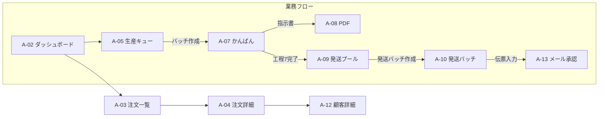
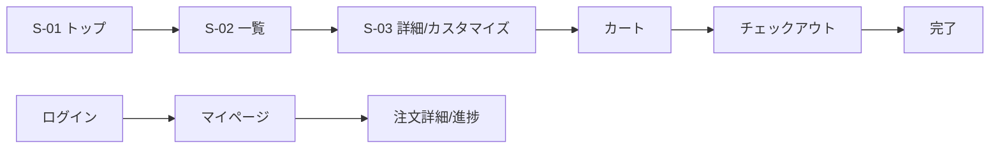

# 画面設計書 v1.0 — 葉車堂 一元管理システム
作成日:2026-07-12 / 根拠:要件定義書v2.0、DB設計書v1.0

## 0. 設計方針
- 利用デバイス:**PC+タブレット併用**(確定)。全管理画面レスポンシブ必須
- 工程操作系(かんばん・検品チェック)はタッチ最優先:タップ領域44px以上、ホバー依存UIの禁止、進行操作は確認ダイアログ付き
- 管理画面はNext.js App Router内の `/admin/*`(Supabase Auth+admin claimで保護)
- フロントは `/ja/*` `/en/*`

---

## 1. 管理画面(A系:16画面)

| ID | 画面 | 主要機能 | 主デバイス |
|----|------|---------|-----------|
| A-01 | ログイン | Supabase Auth(単一管理者) | PC/Tab |
| A-02 | ダッシュボード | 新規注文数/キュー総数/推定待ち週数/受注受付状態/工程別仕掛かり/発送プール数/スループット推移グラフ | PC/Tab |
| A-03 | 注文一覧 | 検索(注文番号/顧客名/期間)、フィルタ(決済St/生産St/樹種/機種/国内外/ソース)、一覧はカード式(タブレット対応) | PC |
| A-04 | 注文詳細 | 二重ステータス表示・変更、明細(仕様スナップショット)、配送先、顧客要望、メール履歴、管理メモ、Stripe/PayPal決済参照 | PC |
| A-05 | 生産キュー | queued/receivedアイテムを受注順表示+**樹種別滞留数サイドパネル**。樹種選択→アイテムをチェック→「バッチ作成」 | PC/Tab |
| A-06 | バッチ一覧 | 進行中/計画/完了タブ、各バッチの現工程・本数・経過日数 | PC/Tab |
| A-07 | バッチかんばん | **中核画面**。工程1〜7の横列、現工程ハイライト、「次工程へ」大型ボタン(確認付き)、アイテム一覧(仕様展開)、製作指示書PDF出力、オーダーメイドは追加工程列を動的挿入 | **Tab** |
| A-08 | 製作指示書PDF | バッチ内全アイテム:注文番号/機種/軸形状/仕上げ/ボタン/インク/利き手/焼印/特注記述。A4印刷レイアウト | 印刷 |
| A-09 | 発送プール | inspected済アイテムを注文単位に集約表示、チェック選択(約6件)→「発送バッチ作成」 | PC/Tab |
| A-10 | 発送バッチ詳細 | 宛名CSV出力(クリックポストまとめ申込形式)、注文ごとの伝票番号入力(入力→発送メール自動トリガー)、一括発送済化 | PC |
| A-11 | 顧客一覧 | 検索、購入回数/キャンセル回数/最終購入日(customer_statsビュー) | PC |
| A-12 | 顧客詳細 | 基本情報、注文履歴、メール履歴、顧客メモ | PC |
| A-13 | メール管理 | 承認待ちドラフト一覧(AI生成→プレビュー・編集→承認送信)、送信履歴、種別ごとの自動送信ON/OFF | PC |
| A-14 | 商品管理 | products/variations CRUD、**受注可否フラグのトグル**、オプショングループ・選択肢管理、国内/海外価格編集 | PC |
| A-15 | 設定 | 受注停止閾値(90日)/バッチサイズ/発送バッチサイズ/全体受注フラグ/スループット手動上書き | PC |
| A-16 | BASEインポート | 注文/顧客CSVアップロード→プレビュー→取込(重複はexternal_refで排除) | PC |

## 2. フロント(S系:12画面 × 日英)

| ID | 画面 | 備考 |
|----|------|------|
| S-01 | トップ | ブランドコンセプト(和の美意識×天然素材)、受注状態バナー(受付中/休止中+推定待ち週数) |
| S-02 | 商品一覧 | フィルタ:機種メーカー/シリーズ/樹種/価格。regionに応じた価格表示 |
| S-03 | 商品詳細 | 樹種説明(Sanity)、**カスタマイズステッパー**:①ペン機種(variation)→②形状→③仕上げ→④ボタン→⑤追加オプション(インク/利き手/焼印)→価格リアルタイム加算。受注停止中は選択不可表示 |
| S-04 | カート | |
| S-05 | チェックアウト | Stripe(主)/PayPal(副)。/ja=国内配送のみ・国内価格、/en=海外配送・海外価格。要望・メッセージ入力欄 |
| S-06 | 注文完了 | 注文番号、推定待ち週数、確認メール送信通知 |
| S-07 | アカウント登録/ログイン | Supabase Auth(メール) |
| S-08 | マイページ | 注文履歴一覧 |
| S-09 | 注文詳細(顧客) | **生産ステータスの可視化**(受付→製作中→検品済→発送済のプログレス表示)、追跡番号リンク |
| S-10 | ガイド | ペンの見分けかた/発送について/FAQ(BASE移行、Sanity管理) |
| S-11 | ブログ/特集 | Sanity |
| S-12 | 法定/About | 特商法表記・プライバシーポリシー・About(日英) |

Phase 2追加予定:S-13 オーダーメイド申込フォーム(写真/動画アップ+質問票6項目)

## 3. 主要画面遷移

## 4. かんばん(A-07)タッチ仕様
- 工程列は横スクロール(タブレット縦持ち対応)
- 「次工程へ」ボタン:高さ56px、誤操作防止の確認モーダル
- 検品(工程7)完了時:アイテム単位のチェックリスト表示→全チェックでバッチ完了→所属アイテム一括inspected化
- 個別アイテムの不良発生:アイテムを「差戻し」でバッチから外しqueuedへ戻す(再製作)

## 5. 状態表示の統一
| production_status | 管理画面表示 | 顧客表示(S-09) |
|---|---|---|
| received/queued | 受付/キュー待ち | ご注文受付 |
| in_batch | 製作中(工程名) | 製作中 |
| inspected/ready_to_ship | 検品済/発送準備 | 発送準備中 |
| shipped | 発送済 | 発送済(追跡) |
| completed | 完了 | お届け済 |
